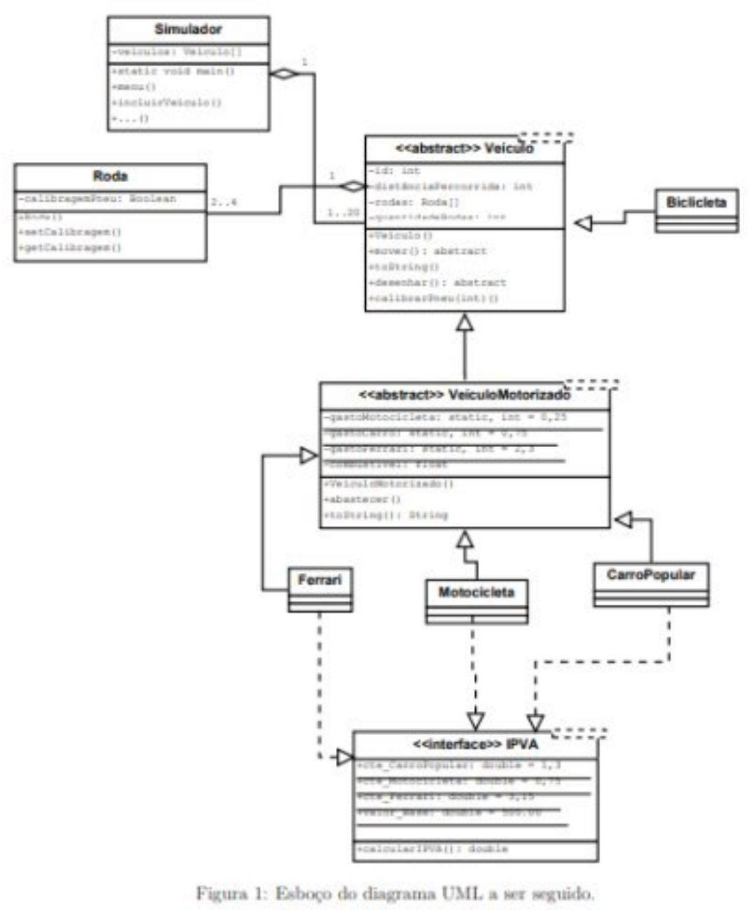

# TRABALHO DE PROGRAMAÇÃO ORIENTADA A OBJETOS - SIMULADOR DE CORRIDA DE VEÍCULOS

- Segundo Trabalho da disciplina de Programação Orientada a Objetos
- **Data de início 01/11/2019**
-  **Data de término xx/11/2019**
- Professora: Luciene  De Oliveira Marin   
- Curso: Engenharia de Computação
- Acadêmicos:  
**Gabriel Prando RA:2039869**  
<gprando@alunos.utfpr.edu.br>  
**Vitor Oliveira dos Santos RA:2037904**  
<vitorsantos.2018@alunos.utfpr.edu.br>
*** 
## Objetivos 

- Desenvolver simulador de corrida de veículos irá controlar veículos do tipo bicicleta, motocicleta, carro popular e ferrari através de seu centro de comandos. Os veículos estarão competindo no estilo
corrida.

- Cada veículo criado possuirá uma identificação única (que deverá ser um número inteiro, gerado automaticamente) e uma quantidade de rodas (cujos pneus estarão calibrados ou não de acordo com um sorteio). Além disso, os veículos motorizados terão uma quantidade inicial de combustível, 3,5 litros, o valor e se o IPVA (Imposto sobre a Propriedade de Veículos Automotores) do veículo está pago ou não.  

- O IPVA de um veículo deverá ser calculado utilizando-se o valor base de R$ 500,00 multiplicado pelo valor da alíquota de cada tipo, ou seja, para motocicleta o valor corresponde a 0,75, para carro popular 1,3 e para ferrari 3,15.  

- Os veículos motorizados podem ser abastecidos e consomem combustível à medida que se deslocam. Eles apenas se movimentam se há combustível suficiente para tal, se os pneus das rodas estiverem todos calibrados e se o IPVA estiver pago. Assume-se que para mover um “bloco” de espaço, a motocicleta gasta 0,25 litros de combustível, o carro polular gasta 0,75 litros e a ferrari
gasta 2,3 litros.  

## Diagrama UML a ser seguido

